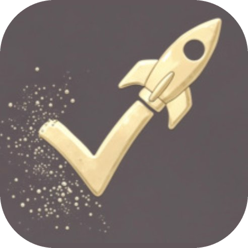
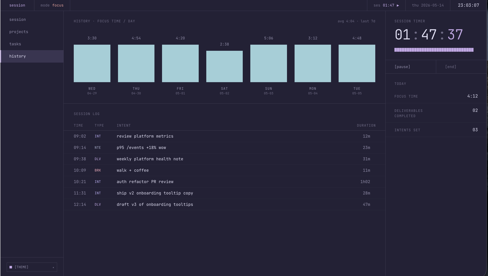

<div align="center">
  
  <h1>tasogare</h1>
  <p>A native macOS focus tracker for engineers.<br/>
  Log sessions, track projects, and build a record of your work — all stored locally, no account needed.</p>
</div>

---



---

## What it does

tasogare is built around a single idea: **commit to one thing, then log what actually happened**. Every session starts with an intent — a one-line statement of what you're about to do. When you stop, you log reality. Over time, the gap between the two becomes your most honest engineering record.

There are three views:

### Daily Log
Your main workspace. Write an intent, start the 90-minute focus timer, and log what actually happened when you stop. Tag sessions as `[Routine]` or `[Engineering]`. Engineering sessions can be linked to a project so hours accumulate automatically.

### Projects
Create long-running engineering projects with a name, a one-line summary, and a full architecture description — goals, blockers, open questions, whatever context you'd want six months from now. Projects show up in a dropdown when you start an Engineering session.

### Interview Deck
Every Engineering session, grouped by project. The architecture description sits at the top of each group to set context, followed by a chronological list of every session: intent, reality, notes, and total hours logged. Built so you can walk into any technical conversation and recall exactly what you built, when, and how long it took.

---

## Features

- **90-minute focus timer** with a live progress ring
- **Intent vs Reality logging** — commit before you start, reflect when you stop
- **Debrief notes** — multiline bug logs and observations saved per session
- **Break button** — pauses the timer mid-session and resumes exactly where you left off
- **Quick Note** (⌘⇧N) — capture a thought instantly without starting a session
- **Delete sessions** — hover any session row for a two-click confirm delete
- **Sort controls** — sort projects and interview sessions by date or alphabetically
- **Keyboard shortcuts** for everything
- **100% local** — SQLite database on your machine, no servers, no accounts

---

## Prerequisites

Install these once. You won't need to repeat them.

> **Platform:** macOS (Apple Silicon — M1/M2/M3/M4). Also runs on macOS Intel.  
> Adaptable to Linux and Windows but not officially tested on those platforms.

### 1 · Xcode Command Line Tools
```bash
xcode-select --install
```
A dialog will appear. Click Install and wait (~10 min). Skip if you see "already installed".

### 2 · Rust
```bash
curl --proto '=https' --tlsv1.2 -sSf https://sh.rustup.rs | sh
source "$HOME/.cargo/env"
```
Press Enter to accept defaults. Verify with `rustc --version`.

### 3 · Node.js via nvm
```bash
# Install nvm
curl -o- https://raw.githubusercontent.com/nvm-sh/nvm/v0.40.4/install.sh | bash

# Make it load in every terminal window — don't skip this
echo 'export NVM_DIR="$HOME/.nvm"' >> ~/.zshrc
echo '[ -s "$NVM_DIR/nvm.sh" ] && \. "$NVM_DIR/nvm.sh"' >> ~/.zshrc
source ~/.zshrc

# Install Node 24
nvm install 24
```
Verify with `node --version` (should print v24+) and `npm --version`.

### 4 · Tauri CLI
```bash
npm install -g @tauri-apps/cli@next
```

---

## Running the app

```bash
# 1. Clone
git clone <your-repo-url> tasogare
cd tasogare

# 2. Install JS dependencies
npm install

# 3. Fetch Rust dependencies (1–3 min, first time only)
cd src-tauri && cargo fetch && cd ..

# 4. Launch
npm run tauri dev
```

The first Rust compile takes **3–5 minutes** — this is normal. Every run after that is under 30 seconds.

---

## Installing to your Mac (dock-pinnable)

To get a proper `.app` you can pin to the dock and open without a terminal:

```bash
# Build (8–15 min first time)
npm run tauri build

# Install to Applications
cp -r src-tauri/target/release/bundle/macos/tasogare.app /Applications/tasogare.app

# Launch
open /Applications/tasogare.app
```

Then right-click the dock icon → **Options** → **Keep in Dock**.

Future updates: repeat the `npm run tauri build` and `cp` commands, then relaunch.

> Note: the build will print a DMG warning — this is harmless. The `.app` builds correctly regardless.

---

## Project structure

```
tasogare/
├── src/
│   ├── App.jsx          # All UI — Daily Log, Projects, Interview Deck
│   ├── db.js            # SQLite query layer (no fetch calls)
│   ├── index.css        # Tailwind v4 + Rosé Pine Moon tokens
│   └── main.jsx         # React entry point
├── src-tauri/
│   ├── src/
│   │   ├── lib.rs       # Plugin registration + app-data directory setup
│   │   └── main.rs      # Calls lib.rs
│   ├── capabilities/
│   │   └── default.json # Tauri v2 SQL permission grants
│   ├── icons/           # App icons (all sizes)
│   ├── Cargo.toml       # Rust dependencies
│   └── tauri.conf.json  # App name, window, CSP, bundle config
├── index.html           # Root HTML + Google Fonts
└── vite.config.js       # Vite + Tailwind plugin
```

---

## Where your data lives

Everything is local. Nothing leaves your machine.

| Platform | Path |
|---|---|
| macOS | `~/Library/Application Support/com.tasogare.app/whitespace.db` |
| Linux | `~/.local/share/com.tasogare.app/whitespace.db` |
| Windows | `%APPDATA%\com.tasogare.app\whitespace.db` |

**Backup:** copy the `.db` file somewhere safe.  
**Reset:** delete the `.db` file and relaunch — the schema recreates itself automatically.

---

## Keyboard shortcuts

| Shortcut | Action |
|---|---|
| `⌥ 1` | Daily Log |
| `⌥ 2` | Projects |
| `⌥ 3` | Interview Deck |
| `⌘ ⇧ N` | Quick Note |
| `⌘ ↵` | Save (inside Quick Note modal) |
| `Esc` | Close modal |
| `⏎` | Commit intent and start timer |

---

## Troubleshooting

**`zsh: command not found: npm`**  
nvm isn't loading. Run `source ~/.zshrc` and try again.

**`error[E0433]: cannot find module tauri_plugin_opener`**  
The scaffold auto-generated a `lib.rs` with a missing plugin reference. Replace `src-tauri/src/lib.rs` with the version in this repo.

**Build fails with `safari13` esbuild errors**  
`vite.config.js` has the wrong build target. Make sure it says `safari16`, not `safari13`.

**App window is white / unstyled**  
`src/index.css` has the default Vite styles. Replace it with the version from this repo.

**DMG bundling fails during `npm run tauri build`**  
Harmless — the `.app` still builds. Add `"targets": ["app"]` under `bundle` in `tauri.conf.json` to skip DMG generation entirely.

---

## Tech stack

| | |
|---|---|
| UI | React 18 |
| Build | Vite 7 |
| Styling | Tailwind CSS v4 |
| Design | Rosé Pine Moon |
| Fonts | Geist, Geist Mono, Fraunces |
| Shell | Tauri v2 |
| Language | Rust 1.95+ |
| Database | SQLite via tauri-plugin-sql |